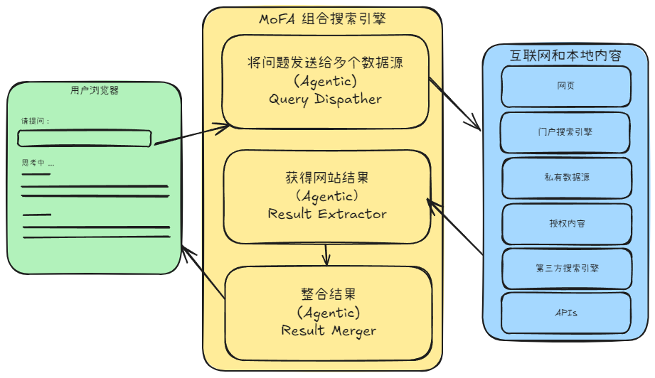

# MoFASearch: 组合搜索引擎

**MoFA搜索引擎**是一个由MoFA社区的魔法师们共同构建的组合搜索引擎。它：

- 不需要爬虫
- 返回实时信息
- 保护用户隐私
- 尊重内容提供者的权益和商业模式
- 搜索范围可超过搜索引擎数十倍，搜索深网和本地信息
- 去中心化的架构，分布式搜索的功能
- 通过智能体的组合实现的搜索
- 是一个由**MoFA社区开发者集体协作，共同实现**的搜索引擎

### 背景

#### 搜索和**元搜索**

Search vs. **Metasearch**

“搜索”和“元搜索”指的是两种不同的传统的搜索方法。它们的主要区别在于数据的来源和处理方式：

1. **搜索（Search）**：
   - 传统搜索引擎（如Google、Bing）有自己的独立数据库和索引体系，用于存储和整理网页内容。
   - 搜索引擎会主动爬取和索引互联网内容，直接提供由其数据库生成的搜索结果。
   - 优势在于能够提供较为全面、快速、个性化的结果，同时允许用户访问存储在其数据库中的多种类型的信息（如网页、图片、新闻等）。
2. **元搜索（Metasearch）**，也称为**集成搜索**：
   - 元搜索引擎（如Dogpile、Metacrawler）本身没有自己的数据库（网页索引），它通过从多个成员搜索引擎收集结果，并将这些结果整合后呈现给用户。
   - 它并不直接爬取网页，而是依赖其他搜索引擎的数据，并可能对结果进行一定的过滤、去重或重新排序，以提高结果的多样性和覆盖面。
   - 优势在于能综合不同搜索引擎的结果，避免单一搜索引擎的局限性，并有助于更广泛地覆盖信息。

**搜索和元搜索的区别总结**

- **数据来源**：搜索引擎有自己的数据库和索引；元搜索引擎依赖其他搜索引擎的数据。
- **信息质量和丰富度**：搜索引擎的结果可能更定制化，但可能会有所偏向；元搜索提供更广泛的覆盖，但可能缺少个性化。
- **效率和速度**：搜索引擎通常速度更快，直接从其索引中提供结果；元搜索的速度可能较慢，因为它要从多个引擎收集和处理结果。

---

#### 表层网络 vs. **深层网络**

1. **表层网络（Surface Web）**：
   - 也称为“可见网络”。
   - 这是互联网上可以被搜索引擎（如Google、Bing、Yahoo等）索引的部分，任何人都可以通过标准搜索工具访问。
   - 包括公共网站、新闻文章、社交媒体个人资料、博客和电子商务网站等。
   - 仅占整个互联网的很小一部分，约为4-5%。
2. **深层网络（Deep Web）**：
   - 是互联网中不被搜索引擎索引的部分，不能通过常规搜索查询直接访问。
   - 深层网络包含私人数据库、学术期刊、医疗记录、政府文件、仅限订阅内容、密码保护的网站和内部公司网站。
   - 通常需要登录、订阅或特定的网址才能访问，但不涉及非法或隐藏的内容。
   - 占据了互联网内容的绝大多数，估计约**90%以上**。

两者的关键区别在于是否可以被搜索引擎爬取和有效索引：表层网络的内容是可以被爬取、索引，因此是可搜索的，而深层网络的内容是是动态生成的，或者有意限制的，是不能爬或不让爬的，通常需要在内容提供商的网络门户进行搜索，或得到他们的授权以后，通过直接链接访问。

MoFA搜索引擎使得用户能够更方便地对深层网络进行搜索。

---

### MoFA搜索：Agent驱动的元搜索引擎

**MoFA Composition Search Engine: Agentic, Distributed, DeepWeb Metasearch Engine**

MoFASearch是一个MoFA社区的大规模试验，我们一起重新定义搜索，我们一起重新定义搜索引擎，我们一起重新定义搜索引擎的方式乃至影响未来搜索的商业模式。

因为大模型和智能体的加持，开发者能够使用更强大的技术，对网站的信息进行更好、更深入的解析；同时，电脑也能更加聪明，能够代表主人做更加复杂的事情； 在可以预见的未来，我们期待网站内容的提供商也将通过智能体与内容的消费者/购买者通过Agentic Web对接。AI的大发展正在深刻地改变着互联网的技术和生态。

- 不需要爬虫：MoFA搜索采用元搜索的基本方法，并在AI的帮助下发展元搜索。MoFA搜索借助大语言模型推理的能力，通过规划智能体来规划搜索路径，选择适当的网站进行搜索。这样，从根本上，MoFA搜索引擎不依赖于用户搜索关键词与爬虫抓取的网站的信息的匹配。 
- 返回实时信息：传统的搜索引擎爬虫方案本质上不能保证搜索信息的实时性。当然，大型搜索引擎往往与一些内容提供商签订合约，从而建立内容提供商向搜索引擎提供实时内容的特殊渠道；或者，大型搜索引擎会频繁地爬取网站信息，使信息尽量新。然而，这些方法都伴随着较大的代价；并不能根本上解决实时信息搜索的要求。MoFA搜索将用户的查询通过AI智能体的直接发给相关网站，因此能获得最新鲜的内容。
- 去中心化的架构，分布式搜索的功能：MoFA Search底层分布式架构的DORA为MoFA Search提供分布式计算的能力。从本地发起搜索，查询分派到不同网站（而不是如Google等中心化的搜索引擎），再在本地分析和整合各网站返回的结果内容。
- 保护用户隐私：本地化和分布式的搜索使得用户不需要将个人信息（包括用户查询）交给中心化的搜索引擎，从而更好地保护用户的隐私。
- 尊重内容提供者的权益和商业模式：内容提供商如华尔街日报等，当他们提供的内容在搜索引擎出现，往往用户不再点击到内容提供商的网站进一步阅读。因此，在传统搜索的世界里，内容提供商面临着：不与搜索引擎合作，则没有用户访问；与搜索引擎合作，则高价值内容被搜索引擎获取而失去价值的困境。长此以往，导致媒体难以生产高价值内容，而互联网充斥着廉价和谬误的信息。MoFA Search希望本地化和分布式的搜索引擎不但能使用户和内容提供商不再需要通过传统搜索引擎的中介而联系起来，还因为大语言模型驱动的智能体能够帮助用户完成内容提供商的用户认证等一系列复杂的操作，从而使双方的连接变得可信和简单。这样，因为内容提供商和用户之间的供需关系变得合理，互联网环境可能更加健康。
- 搜索范围可超过搜索引擎数十倍：基于爬虫的搜索引擎可以有效覆盖表层网络（Surface Web）。而基于元搜索方案的MoFA搜索可以对本地信息、用户订阅信息和众多Web搜索界面背后的数据库信息等深网信息进行搜索。
- 通过智能体的组合实现搜索、超越搜索：对于同一个网站，不同目的的搜索可能想获得不同的信息，因此可以设计不同的MoFA Search Connector Agents和Extractor Agents；通过多模态的Connectors，MoFA Search可以从提供图片的网站获得响应；通过提供Computer Use或Browser Use能力的Connector，MoFA Search可以将搜索查询转变为一系列的复杂操作而获得结果。M oFA Search不但将各智能体返回的结果进行组合，各智能体也引起因为其与众不同的能力而超越了简单的搜索，重新定义了搜索。
- 是一个由**MoFA社区开发者集体协作，共同实现**的搜索引擎：MoFA Search不仅仅是一个由众多Agent组合而构成的搜索引擎，而且是由众多MoFA开发者(魔法师)协作组合而构建的搜索引擎，这是对组合AI理念的实践，也是对”平凡人做非凡事“的证明。

---

### MoFA搜索引擎的实现

如架构图所示，一个MoFA Search Engine由多个成员智能体构成，它的设计细节可以不同，这里我们描述其中的一种实现方式：

1. Search Planner：对用户输入的查询，制定搜索计划，选取最适合当前查询的数据源，准备进行搜索。根据不同的场景，计划可以采用不同的策略。一个复杂的搜索规划智能体还可以针对不同的数据源和不同的策略改写查询，以获得最佳的搜索效果。
2. Query Dispatcher和Web Source Connectors：将用户输入的查询分发到多个数据源。每个数据源可能有对应的Web Source Connector智能体进行连接。Query Dispatcher管理着多个Web Source Connectors, 基于Search Planner的规划，选取多个Connectors，发送查询。
3. Result Extractor：当不同的数据源返回搜索结果，Result Extractor智能体会根据不同的策略在返回的内容中抽取相关搜索的信息，过滤掉无用的信息。
4. Result Merger：整合由各数据源返回并经解析过滤的内容，形成最终报告，返回搜索用户。

各成员智能体也可以有不同的变种。比如，某Search Planner可以规划多次串行进行的搜索，即将前一个搜索的结果作为下一个搜索的输入进行搜索；某个Query Connector可以连接用户的gmail，另一个Connector则能使用用户的账户连接到华尔街日报，... 一切有赖于业务的需求，以及魔法师开发者的想象。

通过MoFA框架，不同的智能体连接在一起，实现不一样的搜索。

### 快速安装MofaSearch
1. [安装mofa框架](https://github.com/moxin-org/mofa/tree/main/python)
2. 克隆本仓库 
   - `git clone git@github.com:RelevantStudy/mofasearch.git`
3. 运行案例 
   - `cd mofasearch/python/examples`
   - 进入案例中运行dataflow