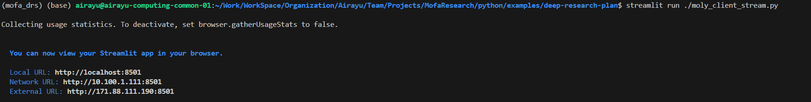
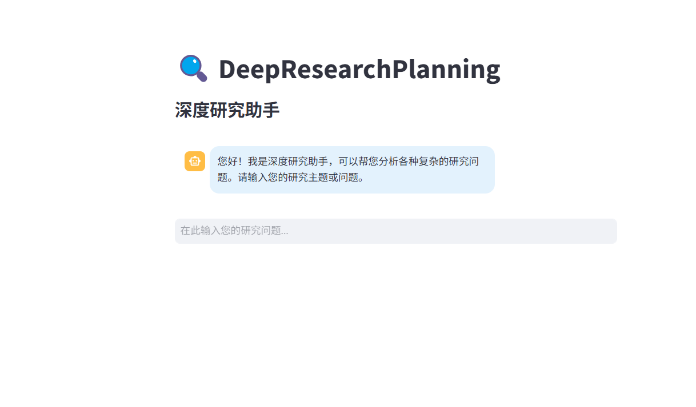

# 简介
此文档用于介绍 mofa-research 的使用流程。

# 流程介绍
## 1. 环境初始化
环境创建
~~~shell
conda create -n mofa_drs python=3.12
conda activate mofa_drs
~~~

## 2. 安装 mofa 依赖和 dora
地址 https://github.com/moxin-org/mofa.git
在项目根目录下执行
~~~shell
mkdir dependents
cd dependents
git clone https://github.com/moxin-org/mofa.git
cd ./dependents/mofa/python/
pip install -e . 
~~~

MOFA 和 Rust 环境方面的问题参考 mofa 项目组官方所提供的文档，这里不再赘述。本人不擅长rust，这里提供了一些在安装初期会用到的命令。
~~~shell
export RUSTUP_DIST_SERVER=https://mirrors.tuna.tsinghua.edu.cn/rustup
export RUSTUP_UPDATE_ROOT=https://mirrors.tuna.tsinghua.edu.cn/rustup/rustup
curl --proto '=https' --tlsv1.2 -sSf https://sh.rustup.rs | sh -s -- -y
~~~

rust 和 dora 的安装配置命令
~~~shell
# 安装 Rust
curl --proto '=https' --tlsv1.2 -sSf https://sh.rustup.rs | sh

# 安装 Dora 运行时
cargo install dora-cli

# 验证安装
rustc --version
cargo --version
dora --version
~~~

## 3. 运行演示项目
前往演示项目目录
~~~shell
cd ./python/examples/deep-research-plan
~~~

需要先配置好环境秘钥信息，首先需要在项目下创建一个 `.env.secert` 文件，然后填入以下内容。
其中 LLM_BASE_URL 为所使用平台的地址， LLM_API_KEY 为所使用平台的API_KEY， LLM_MODEL_NAME 为所使用的模型名称， FIRECRAWL_API_KEY 为所使用的 Firecrawl 的API_KEY。

注: Firecrawl 是一个用于获取网页数据的工具，可以用于获取网页数据。（虽然价格稍微贵一点）

~~~dotenv
LLM_BASE_URL=
LLM_API_KEY=
LLM_MODEL_NAME=
FIRECRAWL_API_KEY=
~~~

使用 dora 启动搜索规划器的后端服务。
~~~shell
dora up && dora build deep-research-dataflow.yml && dora start deep-research-dataflow.yml
~~~

启动后效果如下:

附: 如果需要完全关闭服务，可以使用 `dora destroy` 命令
~~~shell
dora destroy
~~~

## 4. 使用 mofa-research
上面已经显示dora在监听8000端口并且运行中了。
~~~
Uvicorn running on http://0.0.0.0:8000 (Press CTRL+C to quit)
~~~
这时可运行演示项目的前端部分，或者接入自己的项目。
我在演示项目中使用了 Streamlit 来展示前端部分，可以使用以下命令来启动前端。

~~~shell
pip install -r requirements.txt # 如果没有安装过 Streamlit 的话
streamlit run moly_client_stream.py
~~~

效果如下:

访问实际运行时所看到的内部地址或者外部地址即可查看到效果。

### 异常说明
Firecrawl 和 第三方的 LLM 的响应速度很慢，因此运行的时间会比较长，需要耐心等待。
顺带说明，Firecrawl 的请求是有限制的，注册的免费用户有使用限制，注意消耗。

如果在运行过程中出现了 `time out` 错误，可以查看后端的日志信息。

如果出现了很长时间依然没有响应，就有可能遇到了费用限制问题。建议等待一段时间后发现依然不行则选择本地部署LLM或者Firecrawl充值服务(或者多注册几个账号)。