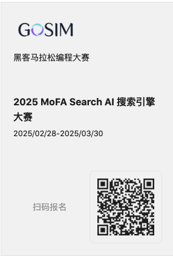

# GOSIM Super Agent Hackathon

March, 2025

#### 内容（What）：

通过组合创新的方式，创建 LLM（大语言模型）驱动的，多智能体组合的搜索引擎，以去中心化的方式搜索网络。

------

#### 意义（Why）：

##### 这场Hackathon的意义与价值

1. 在这个革命性的时代，我们是否应该重新审视并推进搜索范式？
2. Google、Perplexity、OpenAI 的 SearchGPT 还是主要基于爬取技术，有没有更好的、不同的技术？
3. 搜索的主要商业模式（广告）对内容提供者的尊重程度不足，这影响了内容的质量。是否需要纠正？
4. 搜索有效覆盖的网页内容仅为 4%（表层网络），其余 90% 的内容（深层网络）如何处理？
5. 搜索对内容提供者和消费者而言复杂且困难。但借助“AI 智能体”技术，情况大不相同。AI 智能体可以代表内容消费者和提供者，从而全面地完成多项任务。这赋能了内容消费者和提供者。

##### 对 MoFA 的意义和价值

1. 可能涉及数百个智能体，是 MoFA 可扩展性的良好测试案例。
2. 可能需要整合多个不同工具，是 MoFA 的“万物智能体”和组合 AI 概念的良好测试案例。

------
#### 实施方案（How）：

1. MoFA Search提供一个相对简单的搜索引擎框架和一些简单的搜索智能体，参赛的魔法师（即MoFA开发者）们可以依托这个框架进行扩展，实现更加强大的搜索能力。当然，魔法师们也可以选择不依赖于组委会提供的框架而自行构建独特的搜索引擎。

2. 通过MoFA，我们构建组合AI。魔法师们不需要构建一完整的搜索引擎，而是选择实现部分功能，并与其他的功能相结合，实现搜索。这些部分包括，但不限于：
   - 网站连接
   - 结果提取
   - 结果合并
   - 内容源选择
   - 查询重写
   - ...

   

   **处理 MoFA 搜索中单个网站的组件高级架构图**
---

[报名指南](guidelines_sign_on.md)

[比赛规则](rules.md)

---
