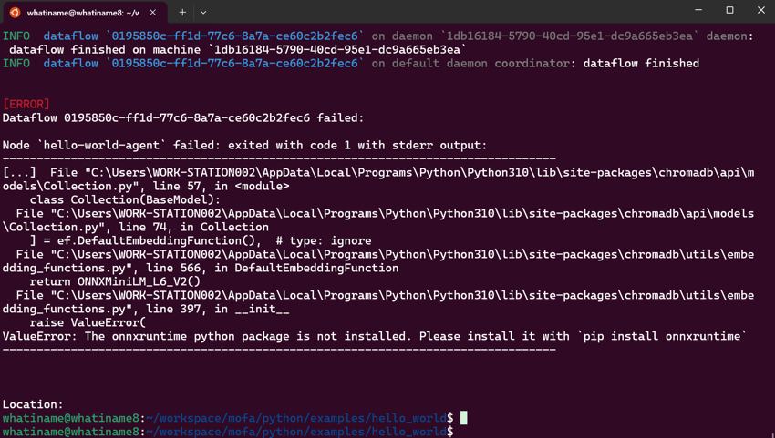

[# 常见问题与解决方案（Q&A）

## 问题 1: 运行 Agent 时出现 `Exited with code 1` 错误

### 描述

在尝试运行  Agent 时，系统返回以下错误信息，导致进程以代码 1 退出。

### 错误信息

```
File "/env/miniconda3/envs/py310/lib/python3.10/site-packages/dspy/teleprompt/finetune.py", line 28, in <module>
      os.makedirs(training_data_directory)
    File "/env/miniconda3/envs/py310/lib/python3.10/os.py", line 225, in makedirs
      mkdir(name, mode)

  FileExistsError: [Errno 17] File exists: 'local_cache/compiler'

Location:
    binaries/runtime/src/operator/python.rs:28:9
```

### 解决方案

1. **删除现有的 `local_cache/compiler` 文件夹**：
   
   - 导航到当前工作目录。
   - 删除 `local_cache/compiler` 文件夹。

2. **重新运行代理**：

   - 确保删除操作成功后，重新执行之前的运行命令。

### 操作步骤

```bash
# 删除 local_cache/compiler 文件夹
rm -rf local_cache/compiler

# 重新运行  代理
dora up && dora build dataflow.yml && dora start dataflow.yml --attach
```

## 问题 2: 运行过程中出现 `No module named 'MOFA'`


### 解决方案

1. 由于Dora运行的时候和当前环境的python版本不一致，导致找不到MOFA模块，需要你将mofa安装你的基础环境中. (例如: 如果你使用conda，则将mofa安装到base环境中)
2. 重新安装mofa到你的基础环境中.重新启动dataflow

## 问题 3: 运行过程中出现 `ValueError: The onnxruntime python package is not installed. Please install it with 'pip install onnxruntime`


### 解决方案
1. 我们暂时不支持使用windows作为运行环境,请您切换到Linux或者macOS系统上运行
2. 你也可以切换到我们提供的docker镜像中运行. 请参考[这里](https://github.com/moxin-org/mofa/blob/main/python/docker/Dockerfile_x86)构建docker镜像

## 问题 4: 使用dora运行dataflow.yml文件时出现错误

dora start hello_world_dataflow.yml --attach

`[ERROR]
Dataflow could not be validated.
`
### 解决方案

代表着你的yml格式存在问题，需要检查一下yml文件的格式是否正确,输入或者输出的结果是否是正确的


## 问题 5: 如何查看Node中的日志呢?

### 解决方案
1. 当你使用dora start某个dataflow的时候,可以在启动的目录下看到一个`out`文件夹,里面存放了你的对应的启动的日志信息
2. 你在noda中使用print的时候,对应的日志信息也会保存起来
3. 你可以使用agent.write_log() 来写入日志信息,它会保存到logs/agent.loh文件中


