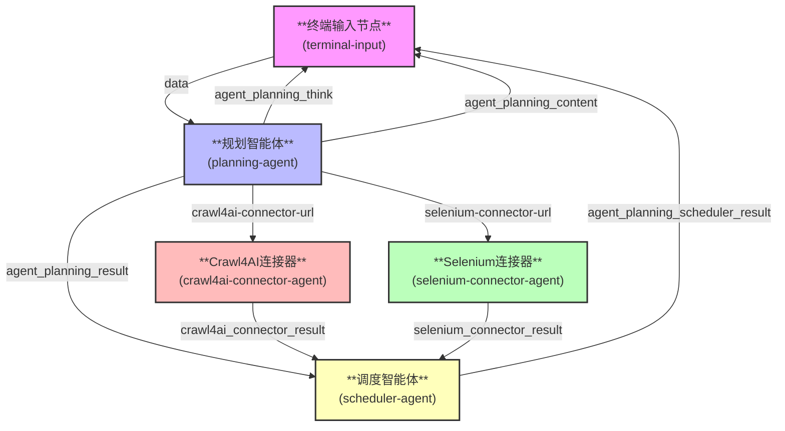

## 核心设计理念

规划智能体作为系统的"大脑"，负责：
1. 智能分析用户输入的任务需求
2. 动态选择最合适的工具和连接器
3. 生成最优的任务执行计划
4. 协调各智能体的执行顺序
5. 整合最终结果并优化输出

## 工作流组件详细说明

### 1. 终端输入节点 (terminal-input)
- **核心作用**：系统入口，接收并预处理用户输入
- **智能连接**：
  - 接收用户原始输入
  - 将任务数据标准化后传递给规划智能体
  - 接收并展示最终结果

### 2. 规划智能体 (planning-agent)
- **核心作用**：系统的智能调度中心
- **智能连接机制**：
  1. **任务解析**：
     - 使用LLM分析用户输入
     - 识别任务类型和需求
     - 确定所需的数据源和处理方式
  2. **工具选择**：
     - 根据任务特点选择连接器
     - 动态评估URL复杂度
     - 分配任务给最适合的连接器
  3. **计划生成**：
     - 创建详细的任务执行步骤
     - 设置任务优先级
     - 定义各智能体的输入输出


- **智能决策逻辑**：
  - 简单静态页面 → 使用Crawl4AI连接器
  - 复杂动态页面 → 使用Selenium连接器
  - 混合型任务 → 并行使用多个连接器
  - 实时调整任务分配策略

### 3. Crawl4AI连接器 (crawl4ai-connector-agent)
- **核心作用**：高效处理动态内容
- **智能连接**：
  - 接收规划智能体分配的URL
  - 自动选择最优的抓取策略
  - 返回结构化数据给调度智能体

### 4. Selenium连接器 (selenium-connector-agent)
- **核心作用**：处理复杂交互页面
- **智能连接**：
  - 接收规划智能体分配的复杂任务
  - 自动配置浏览器参数
  - 返回高质量抓取结果

### 5. 调度智能体 (scheduler-agent)
- **核心作用**：协调和优化任务执行
- **智能连接**：
  - 接收各连接器的结果
  - 验证数据完整性
  - 优化结果展示格式
  - 反馈执行状态给规划智能体

## 智能连接流程详解



## 环境配置

在项目根目录下创建`.env.secret`文件，配置如下参数：

```ini
# LLM服务配置
LLM_API_KEY=your_api_key_here          # 替换为您的API密钥
LLM_BASE_URL=https://api.deepseek.com/v1  # LLM API基础地址

# 模型配置
LLM_MODEL_NAME=deepseek-r1             # 主推理模型，必须使用deepseek-r1或同等推理能力的模型
STRUCT_LLM_MODEL_NAME=deepseek-chat    # 结构化输出模型
```

### 配置说明

1. **LLM_API_KEY**
   - 类型：字符串
   - 说明：用于访问LLM服务的API密钥
   - 注意：请妥善保管，不要提交到版本控制系统

2. **LLM_BASE_URL**
   - 类型：URL
   - 说明：LLM API的服务地址
   - 默认值：`https://api.deepseek.com/v1`

3. **LLM_MODEL_NAME**
   - 类型：字符串
   - 说明：主推理模型名称
   - 要求：必须使用`deepseek-r1`或具有同等推理能力的模型
   - 作用：用于任务分析、规划和决策

4. **STRUCT_LLM_MODEL_NAME**
   - 类型：字符串
   - 说明：结构化输出模型名称
   - 默认值：`deepseek-chat`
   - 作用：用于生成结构化输出和格式化结果

## 安装与运行

```bash
# 1. 初始化环境
dora destroy

# 2. 启动Dora
dora up

# 3. 构建工作流
dora build agent-deepsearch-planning.yml

# 4. 运行工作流（附加调试信息）
dora start agent-deepsearch-planning.yml --attach
```

## 常见问题排查

1. **连接器无法启动**
   - 检查Chrome浏览器是否安装
   - 查看日志文件定位问题

2. **任务执行失败**
   - 检查网络连接
   - 验证API密钥有效性
   - 调整任务超时时间

3. **结果不完整**
   - 检查HTML清理配置
   - 调整页面加载等待时间
   - 验证模型输出格式

4. **性能问题**
   - 调整并行任务数
   - 优化资源分配
   - 启用缓存机制

